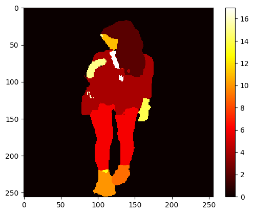
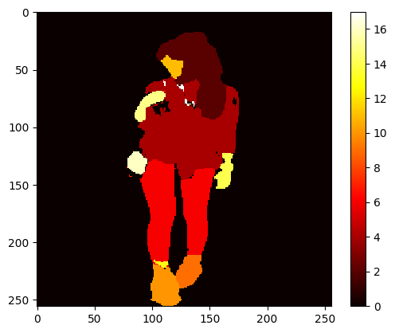
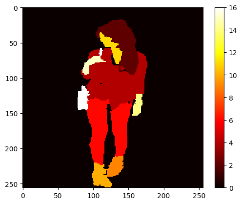

```python
import os
import cv2
import numpy as np
import pandas as pd
import tensorflow as tf
from tensorflow import data as tf_data
from tensorflow import image as tf_image
from tensorflow import io as tf_io
```


```python
file_dir_1 = '/content/drive/MyDrive/atr/train-00000-of-00002-9e861cba931f46ba.parquet'
file_dir_2 = '/content/drive/MyDrive/atr/train-00001-of-00002-118ddee16eed69a9.parquet'
```


```python
data_1 = pd.read_parquet(file_dir_1)
data_2 = pd.read_parquet(file_dir_2)
```


```python
all_data = pd.concat([data_1, data_2], axis=0, ignore_index=True)
print(data_1.shape)
print(data_2.shape)
print(all_data.shape)
```

    (8853, 2)
    (8853, 2)
    (17706, 2)
    


```python
data_1[:2500].shape
```


    (2500, 2)


```python
import numpy as np
from PIL import Image
from sklearn.model_selection import train_test_split
from tensorflow.keras.utils import to_categorical
from io import BytesIO  # Add this import

def prepare_data(df, input_size=(256, 256)):
    # Step 1: Decode byte strings
    df['image'] = df['image'].apply(lambda x: np.array(Image.open(BytesIO(x['bytes'])).convert("RGB")))
    df['mask'] = df['mask'].apply(lambda x: np.array(Image.open(BytesIO(x['bytes'])).convert("L")))

    # Step 2: Resize images and masks
    df['image'] = df['image'].apply(lambda x: np.array(Image.fromarray(x).resize(input_size)))
    df['mask'] = df['mask'].apply(lambda x: np.array(Image.fromarray(x).resize(input_size, resample=Image.NEAREST)))

    # Step 3: Split into X and y
    X = np.stack(df['image'].values)
    y = np.stack(df['mask'].values)

    # Step 4: Normalize pixel values
    X = X / 255.0

    # Step 5: One-hot encode target masks
    y = to_categorical(y, num_classes=18)  # Replace NUM_CLASSES with the number of classes in your segmentation task

    return X, y

# Example usage:
X, y = prepare_data(data_1[:2500])

```

    <ipython-input-6-ee0597e537c7>:9: SettingWithCopyWarning: 
    A value is trying to be set on a copy of a slice from a DataFrame.
    Try using .loc[row_indexer,col_indexer] = value instead
    
    See the caveats in the documentation: https://pandas.pydata.org/pandas-docs/stable/user_guide/indexing.html#returning-a-view-versus-a-copy
      df['image'] = df['image'].apply(lambda x: np.array(Image.open(BytesIO(x['bytes'])).convert("RGB")))
    <ipython-input-6-ee0597e537c7>:10: SettingWithCopyWarning: 
    A value is trying to be set on a copy of a slice from a DataFrame.
    Try using .loc[row_indexer,col_indexer] = value instead
    
    See the caveats in the documentation: https://pandas.pydata.org/pandas-docs/stable/user_guide/indexing.html#returning-a-view-versus-a-copy
      df['mask'] = df['mask'].apply(lambda x: np.array(Image.open(BytesIO(x['bytes'])).convert("L")))
    <ipython-input-6-ee0597e537c7>:13: SettingWithCopyWarning: 
    A value is trying to be set on a copy of a slice from a DataFrame.
    Try using .loc[row_indexer,col_indexer] = value instead
    
    See the caveats in the documentation: https://pandas.pydata.org/pandas-docs/stable/user_guide/indexing.html#returning-a-view-versus-a-copy
      df['image'] = df['image'].apply(lambda x: np.array(Image.fromarray(x).resize(input_size)))
    <ipython-input-6-ee0597e537c7>:14: SettingWithCopyWarning: 
    A value is trying to be set on a copy of a slice from a DataFrame.
    Try using .loc[row_indexer,col_indexer] = value instead
    
    See the caveats in the documentation: https://pandas.pydata.org/pandas-docs/stable/user_guide/indexing.html#returning-a-view-versus-a-copy
      df['mask'] = df['mask'].apply(lambda x: np.array(Image.fromarray(x).resize(input_size, resample=Image.NEAREST)))
    


```python
x_train, x_test = X[0:int(X.shape[0]*0.9)], X[int(X.shape[0]*0.9)::]
y_train, y_test = y[0:int(X.shape[0]*0.9)], y[int(X.shape[0]*0.9)::]
```


```python
import gc

del X, y
gc.collect()  

```


    20


```python
x_train_tensor = tf.convert_to_tensor(x_train, dtype=tf.float32)
y_train_tensor = tf.convert_to_tensor(y_train, dtype=tf.float32)

x_test_tensor = tf.convert_to_tensor(x_test, dtype=tf.float32)
y_test_tensor = tf.convert_to_tensor(y_test, dtype=tf.float32)
```


```python
from keras import layers
import keras

def get_model_v2(img_size, num_classes):

  inputs = keras.Input(shape=img_size + (3,))

  conv1 = layers.Conv2D(64, 3, activation = 'relu', padding = 'same', kernel_initializer = 'he_normal')(inputs)
  conv1 = layers.Conv2D(64, 3, activation = 'relu', padding = 'same', kernel_initializer = 'he_normal')(conv1)
  pool1 = layers.MaxPooling2D(pool_size=(2, 2))(conv1)
  conv2 = layers.Conv2D(128, 3, activation = 'relu', padding = 'same', kernel_initializer = 'he_normal')(pool1)
  conv2 = layers.Conv2D(128, 3, activation = 'relu', padding = 'same', kernel_initializer = 'he_normal')(conv2)
  pool2 = layers.MaxPooling2D(pool_size=(2, 2))(conv2)
  conv3 = layers.Conv2D(256, 3, activation = 'relu', padding = 'same', kernel_initializer = 'he_normal')(pool2)
  conv3 = layers.Conv2D(256, 3, activation = 'relu', padding = 'same', kernel_initializer = 'he_normal')(conv3)
  pool3 = layers.MaxPooling2D(pool_size=(2, 2))(conv3)
  conv4 = layers.Conv2D(512, 3, activation = 'relu', padding = 'same', kernel_initializer = 'he_normal')(pool3)
  conv4 = layers.Conv2D(512, 3, activation = 'relu', padding = 'same', kernel_initializer = 'he_normal')(conv4)
  drop4 = layers.Dropout(0.5)(conv4)
  pool4 = layers.MaxPooling2D(pool_size=(2, 2))(drop4)

  conv5 = layers.Conv2D(1024, 3, activation = 'relu', padding = 'same', kernel_initializer = 'he_normal')(pool4)
  conv5 = layers.Conv2D(1024, 3, activation = 'relu', padding = 'same', kernel_initializer = 'he_normal')(conv5)
  drop5 = layers.Dropout(0.5)(conv5)

  up6 = layers.Conv2D(512, 2, activation = 'relu', padding = 'same', kernel_initializer = 'he_normal')(layers.UpSampling2D(size = (2,2))(drop5))
  merge6 = layers.concatenate([drop4,up6], axis = 3)
  conv6 = layers.Conv2D(512, 3, activation = 'relu', padding = 'same', kernel_initializer = 'he_normal')(merge6)
  conv6 = layers.Conv2D(512, 3, activation = 'relu', padding = 'same', kernel_initializer = 'he_normal')(conv6)

  up7 = layers.Conv2D(256, 2, activation = 'relu', padding = 'same', kernel_initializer = 'he_normal')(layers.UpSampling2D(size = (2,2))(conv6))
  merge7 = layers.concatenate([conv3,up7], axis = 3)
  conv7 = layers.Conv2D(256, 3, activation = 'relu', padding = 'same', kernel_initializer = 'he_normal')(merge7)
  conv7 = layers.Conv2D(256, 3, activation = 'relu', padding = 'same', kernel_initializer = 'he_normal')(conv7)

  up8 = layers.Conv2D(128, 2, activation = 'relu', padding = 'same', kernel_initializer = 'he_normal')(layers.UpSampling2D(size = (2,2))(conv7))
  merge8 = layers.concatenate([conv2,up8], axis = 3)
  conv8 = layers.Conv2D(128, 3, activation = 'relu', padding = 'same', kernel_initializer = 'he_normal')(merge8)
  conv8 = layers.Conv2D(128, 3, activation = 'relu', padding = 'same', kernel_initializer = 'he_normal')(conv8)

  up9 = layers.Conv2D(64, 2, activation = 'relu', padding = 'same', kernel_initializer = 'he_normal')(layers.UpSampling2D(size = (2,2))(conv8))
  merge9 = layers.concatenate([conv1,up9], axis = 3)
  conv9 = layers.Conv2D(64, 3, activation = 'relu', padding = 'same', kernel_initializer = 'he_normal')(merge9)
  conv9 = layers.Conv2D(64, 3, activation = 'relu', padding = 'same', kernel_initializer = 'he_normal')(conv9)

  outputs = layers.Conv2D(num_classes, 3, activation='softmax', padding='same', kernel_initializer='he_normal')(conv9)
  model = keras.Model(inputs, outputs)

  return model


```


```python
!pip install segmentation_models
```

    Collecting segmentation_models
      Downloading segmentation_models-1.0.1-py3-none-any.whl (33 kB)
    Collecting keras-applications<=1.0.8,>=1.0.7 (from segmentation_models)
      Downloading Keras_Applications-1.0.8-py3-none-any.whl (50 kB)
         ━━━━━━━━━━━━━━━━━━━━━━━━━━━━━━━━━━━━━━━━ 50.7/50.7 kB 3.0 MB/s eta 0:00:00
    [?25hCollecting image-classifiers==1.0.0 (from segmentation_models)
      Downloading image_classifiers-1.0.0-py3-none-any.whl (19 kB)
    Collecting efficientnet==1.0.0 (from segmentation_models)
      Downloading efficientnet-1.0.0-py3-none-any.whl (17 kB)
    Requirement already satisfied: scikit-image in /usr/local/lib/python3.10/dist-packages (from efficientnet==1.0.0->segmentation_models) (0.19.3)
    Requirement already satisfied: numpy>=1.9.1 in /usr/local/lib/python3.10/dist-packages (from keras-applications<=1.0.8,>=1.0.7->segmentation_models) (1.23.5)
    Requirement already satisfied: h5py in /usr/local/lib/python3.10/dist-packages (from keras-applications<=1.0.8,>=1.0.7->segmentation_models) (3.9.0)
    Requirement already satisfied: scipy>=1.4.1 in /usr/local/lib/python3.10/dist-packages (from scikit-image->efficientnet==1.0.0->segmentation_models) (1.11.4)
    Requirement already satisfied: networkx>=2.2 in /usr/local/lib/python3.10/dist-packages (from scikit-image->efficientnet==1.0.0->segmentation_models) (3.2.1)
    Requirement already satisfied: pillow!=7.1.0,!=7.1.1,!=8.3.0,>=6.1.0 in /usr/local/lib/python3.10/dist-packages (from scikit-image->efficientnet==1.0.0->segmentation_models) (9.4.0)
    Requirement already satisfied: imageio>=2.4.1 in /usr/local/lib/python3.10/dist-packages (from scikit-image->efficientnet==1.0.0->segmentation_models) (2.31.6)
    Requirement already satisfied: tifffile>=2019.7.26 in /usr/local/lib/python3.10/dist-packages (from scikit-image->efficientnet==1.0.0->segmentation_models) (2023.12.9)
    Requirement already satisfied: PyWavelets>=1.1.1 in /usr/local/lib/python3.10/dist-packages (from scikit-image->efficientnet==1.0.0->segmentation_models) (1.5.0)
    Requirement already satisfied: packaging>=20.0 in /usr/local/lib/python3.10/dist-packages (from scikit-image->efficientnet==1.0.0->segmentation_models) (23.2)
    Installing collected packages: keras-applications, image-classifiers, efficientnet, segmentation_models
    Successfully installed efficientnet-1.0.0 image-classifiers-1.0.0 keras-applications-1.0.8 segmentation_models-1.0.1
    


```python
#!pip install segmentation_models
%env SM_FRAMEWORK=tf.keras
import segmentation_models as sm
dice_loss = sm.losses.DiceLoss()
focal_loss = sm.losses.CategoricalFocalLoss()
total_loss = dice_loss + (1 * focal_loss)
```

    env: SM_FRAMEWORK=tf.keras
    Segmentation Models: using `tf.keras` framework.
    


```python
# Build model
model2 = get_model_v2((256, 256), 18)
model3 = get_model_v2((256, 256), 18)
#model.summary()


model2.compile(
    optimizer=keras.optimizers.Adam(1e-4),
    loss=[focal_loss],
    metrics = ["accuracy",sm.metrics.IOUScore(threshold=0.5), sm.metrics.FScore(threshold=0.5)]
)

model3.compile(
    optimizer=keras.optimizers.Adam(1e-4),
    loss=[total_loss],
    metrics = ["accuracy",sm.metrics.IOUScore(threshold=0.5), sm.metrics.FScore(threshold=0.5)]
)
```


```python
history = model2.fit(x_train_tensor, y_train_tensor, batch_size=2, epochs=40)
```

    Epoch 1/40
    1125/1125 [==============================] - 81s 60ms/step - loss: 0.0067 - accuracy: 0.8029 - iou_score: 0.3117 - f1-score: 0.3291
    Epoch 2/40
    1125/1125 [==============================] - 67s 60ms/step - loss: 0.0038 - accuracy: 0.8593 - iou_score: 0.3955 - f1-score: 0.4460
    Epoch 3/40
    1125/1125 [==============================] - 67s 60ms/step - loss: 0.0031 - accuracy: 0.8788 - iou_score: 0.4406 - f1-score: 0.5017
    Epoch 4/40
    1125/1125 [==============================] - 67s 60ms/step - loss: 0.0026 - accuracy: 0.8914 - iou_score: 0.4646 - f1-score: 0.5305
    Epoch 5/40
    1125/1125 [==============================] - 67s 60ms/step - loss: 0.0023 - accuracy: 0.9009 - iou_score: 0.4917 - f1-score: 0.5624
    Epoch 6/40
    1125/1125 [==============================] - 67s 60ms/step - loss: 0.0021 - accuracy: 0.9087 - iou_score: 0.5090 - f1-score: 0.5825
    Epoch 7/40
    1125/1125 [==============================] - 67s 59ms/step - loss: 0.0019 - accuracy: 0.9156 - iou_score: 0.5298 - f1-score: 0.6055
    Epoch 8/40
    1125/1125 [==============================] - 67s 60ms/step - loss: 0.0018 - accuracy: 0.9199 - iou_score: 0.5439 - f1-score: 0.6198
    Epoch 9/40
    1125/1125 [==============================] - 67s 60ms/step - loss: 0.0016 - accuracy: 0.9260 - iou_score: 0.5628 - f1-score: 0.6400
    Epoch 10/40
    1125/1125 [==============================] - 67s 60ms/step - loss: 0.0015 - accuracy: 0.9307 - iou_score: 0.5798 - f1-score: 0.6573
    Epoch 11/40
    1125/1125 [==============================] - 67s 60ms/step - loss: 0.0013 - accuracy: 0.9363 - iou_score: 0.5950 - f1-score: 0.6724
    Epoch 12/40
    1125/1125 [==============================] - 67s 60ms/step - loss: 0.0012 - accuracy: 0.9404 - iou_score: 0.6091 - f1-score: 0.6862
    Epoch 13/40
    1125/1125 [==============================] - 67s 60ms/step - loss: 0.0012 - accuracy: 0.9433 - iou_score: 0.6168 - f1-score: 0.6934
    Epoch 14/40
    1125/1125 [==============================] - 67s 60ms/step - loss: 0.0011 - accuracy: 0.9479 - iou_score: 0.6329 - f1-score: 0.7089
    Epoch 15/40
    1125/1125 [==============================] - 67s 60ms/step - loss: 9.8229e-04 - accuracy: 0.9510 - iou_score: 0.6453 - f1-score: 0.7200
    Epoch 16/40
    1125/1125 [==============================] - 67s 59ms/step - loss: 9.0631e-04 - accuracy: 0.9546 - iou_score: 0.6627 - f1-score: 0.7367
    Epoch 17/40
    1125/1125 [==============================] - 67s 59ms/step - loss: 8.3003e-04 - accuracy: 0.9573 - iou_score: 0.6740 - f1-score: 0.7470
    Epoch 18/40
    1125/1125 [==============================] - 67s 59ms/step - loss: 8.1079e-04 - accuracy: 0.9581 - iou_score: 0.6754 - f1-score: 0.7478
    Epoch 19/40
    1125/1125 [==============================] - 67s 59ms/step - loss: 7.4059e-04 - accuracy: 0.9609 - iou_score: 0.6937 - f1-score: 0.7644
    Epoch 20/40
    1125/1125 [==============================] - 67s 60ms/step - loss: 7.2521e-04 - accuracy: 0.9619 - iou_score: 0.6967 - f1-score: 0.7674
    Epoch 21/40
    1125/1125 [==============================] - 67s 59ms/step - loss: 6.0378e-04 - accuracy: 0.9668 - iou_score: 0.7197 - f1-score: 0.7877
    Epoch 22/40
    1125/1125 [==============================] - 67s 59ms/step - loss: 6.2850e-04 - accuracy: 0.9660 - iou_score: 0.7135 - f1-score: 0.7820
    Epoch 23/40
    1125/1125 [==============================] - 67s 59ms/step - loss: 6.1513e-04 - accuracy: 0.9665 - iou_score: 0.7229 - f1-score: 0.7907
    Epoch 24/40
    1125/1125 [==============================] - 67s 59ms/step - loss: 5.1448e-04 - accuracy: 0.9707 - iou_score: 0.7425 - f1-score: 0.8074
    Epoch 25/40
    1125/1125 [==============================] - 67s 59ms/step - loss: 5.6738e-04 - accuracy: 0.9687 - iou_score: 0.7372 - f1-score: 0.8025
    Epoch 26/40
    1125/1125 [==============================] - 67s 59ms/step - loss: 4.9101e-04 - accuracy: 0.9716 - iou_score: 0.7540 - f1-score: 0.8176
    Epoch 27/40
    1125/1125 [==============================] - 67s 59ms/step - loss: 4.3731e-04 - accuracy: 0.9741 - iou_score: 0.7664 - f1-score: 0.8277
    Epoch 28/40
    1125/1125 [==============================] - 67s 59ms/step - loss: 5.2696e-04 - accuracy: 0.9699 - iou_score: 0.7444 - f1-score: 0.8088
    Epoch 29/40
    1125/1125 [==============================] - 67s 59ms/step - loss: 3.9413e-04 - accuracy: 0.9760 - iou_score: 0.7831 - f1-score: 0.8420
    Epoch 30/40
    1125/1125 [==============================] - 67s 59ms/step - loss: 4.7892e-04 - accuracy: 0.9724 - iou_score: 0.7620 - f1-score: 0.8241
    Epoch 31/40
    1125/1125 [==============================] - 67s 59ms/step - loss: 4.0309e-04 - accuracy: 0.9756 - iou_score: 0.7815 - f1-score: 0.8408
    Epoch 32/40
    1125/1125 [==============================] - 67s 59ms/step - loss: 3.4829e-04 - accuracy: 0.9781 - iou_score: 0.8017 - f1-score: 0.8581
    Epoch 33/40
    1125/1125 [==============================] - 67s 59ms/step - loss: 5.1238e-04 - accuracy: 0.9709 - iou_score: 0.7573 - f1-score: 0.8201
    Epoch 34/40
    1125/1125 [==============================] - 67s 59ms/step - loss: 3.6403e-04 - accuracy: 0.9777 - iou_score: 0.7971 - f1-score: 0.8536
    Epoch 35/40
    1125/1125 [==============================] - 66s 59ms/step - loss: 3.3125e-04 - accuracy: 0.9787 - iou_score: 0.8084 - f1-score: 0.8631
    Epoch 36/40
    1125/1125 [==============================] - 67s 59ms/step - loss: 3.0389e-04 - accuracy: 0.9802 - iou_score: 0.8194 - f1-score: 0.8729
    Epoch 37/40
    1125/1125 [==============================] - 67s 59ms/step - loss: 3.9196e-04 - accuracy: 0.9760 - iou_score: 0.7910 - f1-score: 0.8490
    Epoch 38/40
    1125/1125 [==============================] - 67s 59ms/step - loss: 3.3059e-04 - accuracy: 0.9788 - iou_score: 0.8095 - f1-score: 0.8640
    Epoch 39/40
    1125/1125 [==============================] - 67s 59ms/step - loss: 3.2116e-04 - accuracy: 0.9794 - iou_score: 0.8173 - f1-score: 0.8709
    Epoch 40/40
    1125/1125 [==============================] - 67s 60ms/step - loss: 2.5247e-04 - accuracy: 0.9827 - iou_score: 0.8440 - f1-score: 0.8934
    


```python
history = model3.fit(x_train_tensor, y_train_tensor, batch_size=2, epochs=40)
```

    Epoch 1/40
    1125/1125 [==============================] - 75s 61ms/step - loss: 0.7768 - accuracy: 0.7838 - iou_score: 0.3148 - f1-score: 0.3748
    Epoch 2/40
    1125/1125 [==============================] - 69s 61ms/step - loss: 0.6103 - accuracy: 0.8468 - iou_score: 0.3397 - f1-score: 0.4264
    Epoch 3/40
    1125/1125 [==============================] - 68s 60ms/step - loss: 0.5514 - accuracy: 0.8706 - iou_score: 0.3815 - f1-score: 0.4698
    Epoch 4/40
    1125/1125 [==============================] - 69s 61ms/step - loss: 0.5186 - accuracy: 0.8848 - iou_score: 0.4132 - f1-score: 0.5016
    Epoch 5/40
    1125/1125 [==============================] - 69s 61ms/step - loss: 0.4935 - accuracy: 0.8955 - iou_score: 0.4409 - f1-score: 0.5276
    Epoch 6/40
    1125/1125 [==============================] - 68s 61ms/step - loss: 0.4727 - accuracy: 0.9039 - iou_score: 0.4664 - f1-score: 0.5511
    Epoch 7/40
    1125/1125 [==============================] - 69s 61ms/step - loss: 0.4590 - accuracy: 0.9101 - iou_score: 0.4815 - f1-score: 0.5647
    Epoch 8/40
    1125/1125 [==============================] - 69s 61ms/step - loss: 0.4429 - accuracy: 0.9170 - iou_score: 0.5036 - f1-score: 0.5848
    Epoch 9/40
    1125/1125 [==============================] - 70s 62ms/step - loss: 0.4341 - accuracy: 0.9215 - iou_score: 0.5159 - f1-score: 0.5957
    Epoch 10/40
    1125/1125 [==============================] - 69s 62ms/step - loss: 0.4266 - accuracy: 0.9252 - iou_score: 0.5278 - f1-score: 0.6051
    Epoch 11/40
    1125/1125 [==============================] - 69s 61ms/step - loss: 0.4129 - accuracy: 0.9296 - iou_score: 0.5437 - f1-score: 0.6205
    Epoch 12/40
    1125/1125 [==============================] - 69s 61ms/step - loss: 0.4049 - accuracy: 0.9337 - iou_score: 0.5560 - f1-score: 0.6308
    Epoch 13/40
    1125/1125 [==============================] - 69s 61ms/step - loss: 0.3962 - accuracy: 0.9373 - iou_score: 0.5704 - f1-score: 0.6439
    Epoch 14/40
    1125/1125 [==============================] - 69s 61ms/step - loss: 0.3887 - accuracy: 0.9413 - iou_score: 0.5841 - f1-score: 0.6555
    Epoch 15/40
    1125/1125 [==============================] - 69s 61ms/step - loss: 0.3872 - accuracy: 0.9418 - iou_score: 0.5865 - f1-score: 0.6574
    Epoch 16/40
    1125/1125 [==============================] - 69s 61ms/step - loss: 0.3796 - accuracy: 0.9447 - iou_score: 0.5982 - f1-score: 0.6675
    Epoch 17/40
    1125/1125 [==============================] - 69s 61ms/step - loss: 0.3718 - accuracy: 0.9483 - iou_score: 0.6100 - f1-score: 0.6777
    Epoch 18/40
    1125/1125 [==============================] - 69s 61ms/step - loss: 0.3691 - accuracy: 0.9501 - iou_score: 0.6216 - f1-score: 0.6881
    Epoch 19/40
    1125/1125 [==============================] - 69s 61ms/step - loss: 0.3625 - accuracy: 0.9521 - iou_score: 0.6295 - f1-score: 0.6950
    Epoch 20/40
    1125/1125 [==============================] - 69s 61ms/step - loss: 0.3619 - accuracy: 0.9517 - iou_score: 0.6267 - f1-score: 0.6923
    Epoch 21/40
    1125/1125 [==============================] - 69s 61ms/step - loss: 0.3534 - accuracy: 0.9558 - iou_score: 0.6469 - f1-score: 0.7096
    Epoch 22/40
    1125/1125 [==============================] - 69s 61ms/step - loss: 0.3559 - accuracy: 0.9345 - iou_score: 0.5967 - f1-score: 0.6657
    Epoch 23/40
    1125/1125 [==============================] - 69s 61ms/step - loss: 0.3371 - accuracy: 0.9424 - iou_score: 0.6190 - f1-score: 0.6842
    Epoch 24/40
    1125/1125 [==============================] - 69s 61ms/step - loss: 0.3528 - accuracy: 0.9379 - iou_score: 0.5980 - f1-score: 0.6660
    Epoch 25/40
    1125/1125 [==============================] - 69s 61ms/step - loss: 0.3507 - accuracy: 0.9359 - iou_score: 0.5979 - f1-score: 0.6670
    Epoch 26/40
    1125/1125 [==============================] - 68s 60ms/step - loss: 0.3252 - accuracy: 0.9453 - iou_score: 0.6294 - f1-score: 0.6949
    Epoch 27/40
    1125/1125 [==============================] - 69s 61ms/step - loss: 0.3373 - accuracy: 0.9406 - iou_score: 0.6219 - f1-score: 0.6863
    Epoch 28/40
    1125/1125 [==============================] - 69s 61ms/step - loss: 0.3272 - accuracy: 0.9448 - iou_score: 0.6320 - f1-score: 0.6951
    Epoch 29/40
    1125/1125 [==============================] - 69s 61ms/step - loss: 0.3788 - accuracy: 0.9225 - iou_score: 0.5709 - f1-score: 0.6407
    Epoch 30/40
    1125/1125 [==============================] - 69s 61ms/step - loss: 0.3232 - accuracy: 0.9475 - iou_score: 0.6357 - f1-score: 0.6974
    Epoch 31/40
    1125/1125 [==============================] - 68s 61ms/step - loss: 0.3069 - accuracy: 0.9530 - iou_score: 0.6557 - f1-score: 0.7158
    Epoch 32/40
    1125/1125 [==============================] - 69s 61ms/step - loss: 0.3688 - accuracy: 0.9289 - iou_score: 0.5833 - f1-score: 0.6510
    Epoch 33/40
    1125/1125 [==============================] - 69s 61ms/step - loss: 0.3408 - accuracy: 0.9382 - iou_score: 0.6093 - f1-score: 0.6770
    Epoch 34/40
    1125/1125 [==============================] - 69s 61ms/step - loss: 0.3141 - accuracy: 0.9497 - iou_score: 0.6474 - f1-score: 0.7077
    Epoch 35/40
    1125/1125 [==============================] - 68s 60ms/step - loss: 0.3033 - accuracy: 0.9543 - iou_score: 0.6605 - f1-score: 0.7186
    Epoch 36/40
    1125/1125 [==============================] - 69s 61ms/step - loss: 0.3123 - accuracy: 0.9504 - iou_score: 0.6467 - f1-score: 0.7074
    Epoch 37/40
    1125/1125 [==============================] - 69s 61ms/step - loss: 0.3137 - accuracy: 0.9495 - iou_score: 0.6465 - f1-score: 0.7071
    Epoch 38/40
    1125/1125 [==============================] - 69s 61ms/step - loss: 0.2995 - accuracy: 0.9555 - iou_score: 0.6670 - f1-score: 0.7239
    Epoch 39/40
    1125/1125 [==============================] - 69s 61ms/step - loss: 0.3076 - accuracy: 0.9521 - iou_score: 0.6582 - f1-score: 0.7179
    Epoch 40/40
    1125/1125 [==============================] - 69s 61ms/step - loss: 0.3484 - accuracy: 0.9352 - iou_score: 0.6065 - f1-score: 0.6728
    


```python
model2.save('my_model_focal_loss.h5')
model3.save('my_model_total_loss.h5')
```

    /usr/local/lib/python3.10/dist-packages/keras/src/engine/training.py:3103: UserWarning: You are saving your model as an HDF5 file via `model.save()`. This file format is considered legacy. We recommend using instead the native Keras format, e.g. `model.save('my_model.keras')`.
      saving_api.save_model(
    


```python

pred2 = model2.predict(x_test_tensor[:5])
pred3 = model3.predict(x_test_tensor[:5])

pred2_img_arr_0 = np.argmax(pred2[0], axis=2).reshape(256, 256, 1)
pred3_img_arr_0 = np.argmax(pred3[0], axis=2).reshape(256, 256, 1)

import matplotlib.pyplot as plt
import numpy as np


TempLake = pred2_img_arr_0
im = plt.imshow(TempLake, cmap='hot', interpolation='none')
plt.colorbar(im)
plt.show()

TempLake = pred3_img_arr_0
im = plt.imshow(TempLake, cmap='hot', interpolation='none')
plt.colorbar(im)
plt.show()

pred2_img_arr_0 = np.argmax(y_test_tensor[0], axis=2).reshape(256, 256, 1)
TempLake = pred2_img_arr_0
im = plt.imshow(TempLake, cmap='hot', interpolation='none')
plt.colorbar(im)
plt.show()

print('---------focal-loss----------')
print(focal_loss(y_test_tensor[0], pred2[0]))
print(focal_loss(y_test_tensor[0], pred3[0]))
print('---------diss-loss----------')
print(dice_loss(y_test_tensor[0], pred2[0]))
print(dice_loss(y_test_tensor[0], pred3[0]))
print('---------total-loss----------')
print(total_loss(y_test_tensor[0], pred2[0]))
print(total_loss(y_test_tensor[0], pred3[0]))


```

    1/1 [==============================] - 2s 2s/step
    1/1 [==============================] - 0s 213ms/step
    


    

    


    

    


    

    


    ---------focal-loss----------
    tf.Tensor(0.00080592395, shape=(), dtype=float32)
    tf.Tensor(0.0029105279, shape=(), dtype=float32)
    ---------diss-loss----------
    tf.Tensor(0.06093204, shape=(), dtype=float32)
    tf.Tensor(0.025648654, shape=(), dtype=float32)
    ---------total-loss----------
    tf.Tensor(0.061737966, shape=(), dtype=float32)
    tf.Tensor(0.028559182, shape=(), dtype=float32)
    


```python
model2.save('/content/drive/MyDrive/ATR_SEG_CLOTHES/my_model_focal_loss.keras')
model3.save('/content/drive/MyDrive/ATR_SEG_CLOTHES/my_model_total_loss.keras')
```
